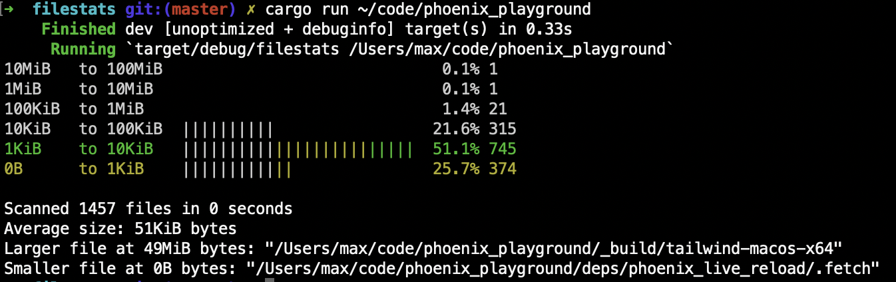

## Utility that outputs colorful statistics about the size of your files

### Usage:

```shell
Utility that outputs colorful statistics about the size of your files

Usage: filestats [OPTIONS] [PATHS]...

Arguments:
  [PATHS]...  

Options:
  -d, --max-depth <MAX_DEPTH>      max depth to consider. 0 = do not recurse into subdirectories. Default: infinity
  -v, --verbose                    shows verbose information about errors
  -p, --parallelism <PARALLELISM>  how many paths will be visited in parallel, defaults to 1000
  -h, --help                       Print help
  -V, --version                    Print version
```

### Output:

